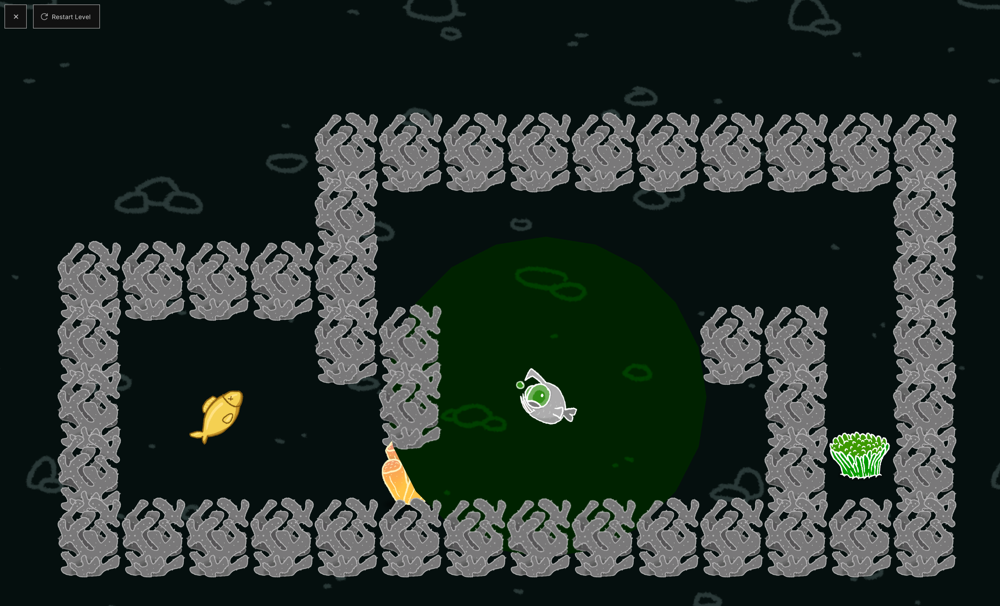

# Deep Sea

Colltect bulbs so your fish sees the maze in a different light.

Play the game: [https://thejp.itch.io/deep-sea](https://thejp.itch.io/deep-sea)

## How to Play

Use the arrow keys to move the deep sea fish through the underground mazes. WASD keys or a gamepad can also be used instead of the arrow keys.

Depending on which bulbs your fish obtains, it sees the maze in a different light.

## Credits

Art: Max Egli (he/him)

Code: Janis Peyer (he/him)

Idea and Level Design: both

## Gameplay Screenshot

